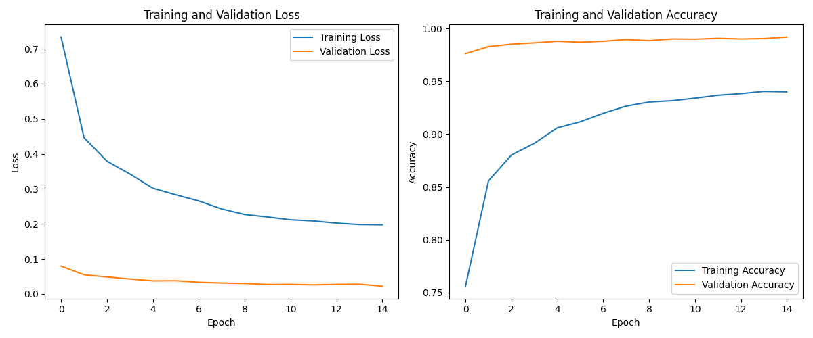

# Model Component (PyTorch CNN & API Service)

This directory contains all components related to the MNIST machine learning model, including its definition, training scripts, evaluation utilities, preprocessing functions, and the Flask API service used for serving predictions.


## 🧠 Overview

The core of this component is a Convolutional Neural Network (CNN) built with PyTorch, trained to recognize handwritten digits (0-9) from 28x28 grayscale images. It also includes a lightweight Flask API (`app.py`) that loads the trained model and exposes endpoints (`/predict`, `/health`) for the web application (or other clients) to consume. Utilities for data preprocessing, augmentation, evaluation, and calibration are provided in the `utils/` subdirectory.

## ✨ Features

*   **CNN Model:** Defines the `MNISTClassifier` neural network architecture in `model.py`.
*   **Training Pipeline:** Script (`train.py`) for training the model on the MNIST dataset, including data loading, augmentation, validation, temperature scaling calibration, and saving the best model weights.
*   **Inference API:** A Flask application (`app.py`) serving the trained model over HTTP.
    *   `/predict` endpoint: Accepts base64-encoded images and returns JSON with prediction and confidence.
    *   `/health` endpoint: Checks if the API is running and the model is loaded.
*   **Preprocessing:** Utilities (`utils/preprocessing.py`) to prepare input images (resizing, normalization, centering) for the model.
*   **Augmentation:** Data augmentation techniques (`utils/augmentation.py`) used during training to improve model robustness.
*   **Evaluation:** Scripts and functions (`utils/evaluation.py`) to assess model performance (accuracy, confusion matrix, classification report).
*   **Calibration:** Temperature scaling implementation (`utils/calibration.py`) to improve the reliability of model confidence scores.
*   **Testing:** Unit tests (`tests/`) for model architecture, preprocessing, and inference components.

## 💻 Technology Stack

*   **ML Framework:** [PyTorch](https://pytorch.org/) (for model definition, training, and inference)
*   **API Framework:** [Flask](https://flask.palletsprojects.com/) (for creating the prediction API)
*   **API Server:** [Gunicorn](https://gunicorn.org/) (WSGI server used in Docker)
*   **Image Processing:** [Pillow](https://python-pillow.org/)
*   **Numerical Computing:** [NumPy](https://numpy.org/)
*   **Data Handling/Loading:** [TorchVision](https://pytorch.org/vision/stable/index.html)
*   **Evaluation Metrics:** [Scikit-learn](https://scikit-learn.org/stable/) (for confusion matrix, classification report)
*   **Plotting (Utilities):** [Matplotlib](https://matplotlib.org/) (for generating evaluation plots)

## 📁 Folder Structure

```plaintext
model/
├── Dockerfile              # Docker build instructions for the model service
├── requirements.txt        # Python dependencies for the model component
├── app.py                  # Flask API application
├── model.py                # CNN model definition (MNISTClassifier)
├── train.py                # Script to train the model
├── inference.py            # Class/functions for making predictions (used by app.py)
├── utils/                  # Helper utilities
│   ├── __init__.py
│   ├── augmentation.py     # Data augmentation functions
│   ├── calibration.py      # Temperature scaling logic
│   ├── evaluation.py       # Model evaluation functions & plotting
│   └── preprocessing.py    # Image preprocessing functions
├── tests/                  # Unit tests for model components
│   ├── __init__.py
│   ├── test_model.py
│   ├── test_preprocessing.py
│   └── test_inference.py
├── saved_models/           # Default location for saved model weights (.pt) and calibration temp (.json)
│   ├── mnist_classifier.pt # (Example - Generated by train.py)
│   └── optimal_temperature.json # (Example - Generated by train.py)
└── outputs/                # Default location for generated plots/reports during training/eval
    ├── figures/
    └── logs/
```

## 🏗️ Model Architecture

The model (`model.py`) is a standard Convolutional Neural Network (CNN) comprising:
*   Two convolutional layers (`nn.Conv2d`) with ReLU activation and Batch Normalization (`nn.BatchNorm2d`).
*   Max pooling layers (`nn.MaxPool2d`) after each convolutional block.
*   Dropout layers (`nn.Dropout2d`, `nn.Dropout`) for regularization.
*   Two fully connected (linear) layers (`nn.Linear`) to produce the final classification logits.
*   The output layer has 10 units, corresponding to digits 0-9.

*(See `model.py` for the exact layer definitions and parameters).*

## 🌐 API Service (`app.py`)

The Flask API provides the inference capability for the trained model.

*   **`/health` (GET):** Returns a JSON response indicating the service status and whether the model file was successfully loaded.
    ```json
    { "status": "healthy", "model_loaded": true }
    ```
*   **`/predict` (POST):**
    *   **Request:** Expects a JSON payload with a single key `image` containing a base64-encoded string of the input image (e.g., from the drawing canvas or an uploaded file).
        ```json
        { "image": "base64_encoded_image_data..." }
        ```
    *   **Preprocessing:** The API preprocesses the incoming image (decoding, ensuring White-on-Black, padding, centering, resizing, normalization) before feeding it to the model. Debug images might be saved to `outputs/debug_images/` if enabled.
    *   **Response:** Returns a JSON response with the predicted digit, calibrated confidence score (using temperature scaling), and timing information.
        ```json
        {
          "prediction": 5,
          "confidence": 0.9876,
          "preprocessing_time_ms": 15.2,
          "inference_time_ms": 5.8,
          "total_time_ms": 21.0
        }
        ```

## 🏋️ Training (`train.py`)

The `train.py` script handles the end-to-end training process:

1.  **Data Loading:** Downloads and prepares the MNIST dataset using `torchvision.datasets`.
2.  **Splitting:** Splits the training data into training and validation sets. The validation set is used for finding the best model epoch and for temperature scaling calibration.
3.  **Augmentation:** Applies data augmentations (rotation, translation, scaling, shear, perspective, elastic deformation, blur) defined in `utils/augmentation.py` to the training data.
4.  **Model Initialization:** Creates an instance of the `MNISTClassifier`.
5.  **Training Loop:** Iterates over epochs, performs forward and backward passes, calculates loss (Cross Entropy), and updates weights using the Adam optimizer. Includes learning rate scheduling (`ReduceLROnPlateau`).
6.  **Validation:** Evaluates the model on the validation set after each epoch.
7.  **Model Saving:** Saves the model state (`.pt` file) with the lowest validation loss to the `saved_models/` directory.
8.  **Temperature Scaling:** After training, loads the best model and optimizes a temperature parameter on the validation set to calibrate confidence scores (saves temp to `.json` file).
9.  **Final Evaluation:** Evaluates the calibrated model on the test set, generating reports and plots (saved to `outputs/`).


**Example Training Run:**

Training for 15 epochs on an M4 Pro (using MPS) with a batch size of 512 takes approximately 11-12 minutes (around 709 seconds based on logs).

**To run training (typically outside Docker, in a development environment with dependencies installed):**
```bash
# Ensure you are in the project root directory
python -m model.train --epochs 15 --batch_size 512 --lr 0.001
```
*(Adjust parameters as needed. Ensure `saved_models/` and `outputs/` exist or have write permissions.)*

## 🚀 Performance (MPS Acceleration)
The model training and inference leverage Apple's Metal Performance Shaders (MPS) via PyTorch for significant speedups on compatible hardware (like the M4 Pro used for development).


The benchmarks show:

- Matrix multiplication speedups increase with matrix size, reaching ~1.8x for 4000x4000 matrices.
- CNN inference speedups increase significantly with batch size, achieving ~7x speedup for larger batches (64, 256).

*(Note: Training speedup may vary depending on the operations used and batch size. Refer to utils/mps_verification.py for detailed benchmarks.)*

## 📊 Evaluation & Utilities (`utils/`)

The `utils/` directory provides essential helper functions:

*   `preprocessing.py`: Image transformations required before inference.
*   `augmentation.py`: Data augmentation pipelines for training.
*   `evaluation.py`: Functions to calculate accuracy, generate classification reports, plot confusion matrices, and visualize predictions.
*   `calibration.py`: Implements temperature scaling for confidence calibration and reliability diagram plotting.

| Confusion Matrix | Reliability Diagram |
|------------------|---------------------|
|  |  |

## ⚙️ Setup & Running (as a Service)

This model component runs as the `model` service within the project's Docker Compose setup.

1.  **Dockerfile (`model/Dockerfile`):** Defines the image build process, installing Python, dependencies from `requirements.txt`, creating necessary directories, and setting the entry point to run the Flask API (`python app.py`).
2.  **Docker Compose (`docker-compose.yml`):**
    *   Defines the `model` service using the image built from `model/Dockerfile`.
    *   Mounts the `model/` directory as a volume (optional, useful for development to see code changes without rebuilding).
    *   Exposes port `5000` internally within the Docker network (the web service connects to `http://model:5000`).
    *   Sets `restart: always`.
3.  **Running:** The service is started automatically when you run `docker-compose up` in the project root directory. The `web` service depends on it.

*(Note: Direct execution of `app.py` outside Docker requires Flask and other dependencies to be installed in the environment and might need environment variables like `MODEL_PATH` set manually.)*

