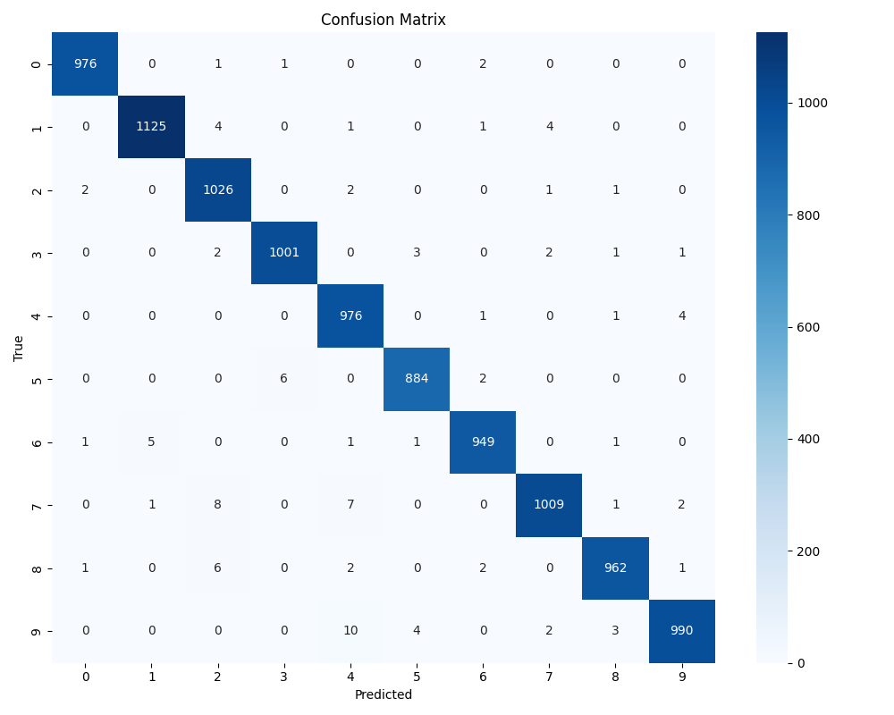

# Model Service 🧠

This directory contains the PyTorch-based Convolutional Neural Network (CNN) model for digit classification, along with the Flask API service that exposes it for inference.


 
 ## 🧠 Overview
 
 The core of this component is a Convolutional Neural Network (CNN) built with PyTorch, trained to recognize handwritten digits (0-9) from 28x28 grayscale images. It also includes a lightweight Flask API (`app.py`) that loads the trained model and exposes endpoints (`/predict`, `/health`) for the web application (or other clients) to consume. Utilities for data preprocessing, augmentation, evaluation, and calibration are provided in the `utils/` subdirectory.
 
 ## ✨ Features
 
 *   **CNN Model:** Defines the `MNISTClassifier` neural network architecture in `model.py`.
 *   **Training Pipeline:** Script (`train.py`) for training the model on the MNIST dataset, including data loading, augmentation, validation, temperature scaling calibration, and saving the best model weights.
 *   **Inference API:** A Flask application (`app.py`) serving the trained model over HTTP.
     *   `/predict` endpoint: Accepts base64-encoded images and returns JSON with prediction and confidence.
     *   `/health` endpoint: Checks if the API is running and the model is loaded.
 *   **Preprocessing:** Utilities (`utils/preprocessing.py`) to prepare input images (resizing, normalization, centering) for the model.
 *   **Augmentation:** Data augmentation techniques (`utils/augmentation.py`) used during training to improve model robustness.
 *   **Evaluation:** Scripts and functions (`utils/evaluation.py`) to assess model performance (accuracy, confusion matrix, classification report).
 *   **Calibration:** Temperature scaling implementation (`utils/calibration.py`) to improve the reliability of model confidence scores.
 *   **Testing:** Unit tests (`tests/`) for model architecture, preprocessing, and inference components.
 
 ## 💻 Technology Stack
 
 *   **ML Framework:** [PyTorch](https://pytorch.org/) (for model definition, training, and inference)
 *   **API Framework:** [Flask](https://flask.palletsprojects.com/) (for creating the prediction API)
 *   **API Server:** [Gunicorn](https://gunicorn.org/) (WSGI server used in Docker)
 *   **Image Processing:** [Pillow](https://python-pillow.org/)
 *   **Numerical Computing:** [NumPy](https://numpy.org/)
 *   **Data Handling/Loading:** [TorchVision](https://pytorch.org/vision/stable/index.html)
 *   **Evaluation Metrics:** [Scikit-learn](https://scikit-learn.org/stable/) (for confusion matrix, classification report)
 *   **Plotting (Utilities):** [Matplotlib](https://matplotlib.org/) (for generating evaluation plots)
 
 ## 📁 Folder Structure
 
 ```plaintext
 model/
 ├── Dockerfile              # Docker build instructions for the model service
 ├── requirements.txt        # Python dependencies for the model component
 ├── app.py                  # Flask API application
 ├── model.py                # CNN model definition (MNISTClassifier)
 ├── train.py                # Script to train the model
 ├── inference.py            # Class/functions for making predictions (used by app.py)
 ├── utils/                  # Helper utilities
 │   ├── __init__.py
 │   ├── augmentation.py     # Data augmentation functions
 │   ├── calibration.py      # Temperature scaling logic
 │   ├── evaluation.py       # Model evaluation functions & plotting
 │   └── preprocessing.py    # Image preprocessing functions
 ├── tests/                  # Unit tests for model components
 │   ├── __init__.py
 │   ├── test_model.py
 │   ├── test_preprocessing.py
 │   └── test_inference.py
 ├── saved_models/           # Default location for saved model weights (.pt) and calibration temp (.json)
 │   ├── mnist_classifier.pt # (Example - Generated by train.py)
 │   └── optimal_temperature.json # (Example - Generated by train.py)
 └── outputs/                # Default location for generated plots/reports during training/eval
     ├── figures/
     └── logs/
 ```
 
 ## 🏗️ Model Architecture
 
 The model (`model.py`) is a standard Convolutional Neural Network (CNN) comprising:
 *   Two convolutional layers (`nn.Conv2d`) with ReLU activation and Batch Normalization (`nn.BatchNorm2d`).
 *   Max pooling layers (`nn.MaxPool2d`) after each convolutional block.
 *   Dropout layers (`nn.Dropout2d`, `nn.Dropout`) for regularization.
 *   Two fully connected (linear) layers (`nn.Linear`) to produce the final classification logits.
 *   The output layer has 10 units, corresponding to digits 0-9.
 
 *(See `model.py` for the exact layer definitions and parameters).*

## 📄 Contents

- **`model.py`**: Defines the CNN architecture used for digit classification
- **`train.py`**: Script for training the model on the MNIST dataset
- **`app.py`**: Flask application that serves the model via a REST API
- **`utils/`**: Helper functions for model training, evaluation, and inference 
- **`Dockerfile`**: Instructions for containerizing the model service
- **`requirements.txt`**: Python dependencies for the model service

## 🧮 Model Architecture

The MNIST digit classifier uses a Convolutional Neural Network (CNN) with the following architecture:

```
CNN(
  (conv1): Conv2d(1, 32, kernel_size=(3, 3), stride=(1, 1))
  (conv2): Conv2d(32, 64, kernel_size=(3, 3), stride=(1, 1))
  (dropout1): Dropout(p=0.25)
  (dropout2): Dropout(p=0.5)
  (fc1): Linear(in_features=9216, out_features=128, bias=True)
  (fc2): Linear(in_features=128, out_features=10, bias=True)
)
```

This model achieves over 99% accuracy on the MNIST test set.

## 🚀 Training

The model is trained using the `train.py` script, which:

1. Loads the MNIST dataset via TorchVision
2. Applies data transformations (normalization, augmentation)
3. Trains the model using cross-entropy loss and the Adam optimizer
4. Performs temperature scaling for better calibrated confidence scores
5. Saves the trained model to disk

## 🌐 API Service

The `app.py` file implements a Flask application that:

1. Loads the pre-trained model
2. Exposes a `/predict` endpoint for digit classification
3. Preprocesses input images to match MNIST format (28x28 grayscale)
4. Returns predicted digit and confidence score in JSON format
5. Provides a `/health` endpoint for service monitoring

API endpoints:

- **POST /predict**: Accepts base64-encoded images and returns digit predictions
- **GET /health**: Returns service status information

## 🐳 Docker Integration

The model service is containerized using Docker and can be built and run with:

```bash
docker build -t mnist-model-service .
docker run -p 5000:5000 mnist-model-service
```

In the full application, this service is managed alongside the web frontend and database using Docker Compose.

## 🚀 Performance (MPS Acceleration)
 The model training and inference leverage Apple's Metal Performance Shaders (MPS) via PyTorch for significant speedups on compatible hardware (like the M4 Pro used for development).
 
 
 
 The benchmarks show:
 
 - Matrix multiplication speedups increase with matrix size, reaching ~1.8x for 4000x4000 matrices.
 - CNN inference speedups increase significantly with batch size, achieving ~7x speedup for larger batches (64, 256).
 
 *(Note: Training speedup may vary depending on the operations used and batch size. Refer to utils/mps_verification.py for detailed benchmarks.)*

 ## 📊 Evaluation & Utilities (`utils/`)
 
 The `utils/` directory provides essential helper functions:
 
 *   `preprocessing.py`: Image transformations required before inference.
 *   `augmentation.py`: Data augmentation pipelines for training.
 *   `evaluation.py`: Functions to calculate accuracy, generate classification reports, plot confusion matrices, and visualize predictions.
 *   `calibration.py`: Implements temperature scaling for confidence calibration and reliability diagram plotting.
 
 | Confusion Matrix | Reliability Diagram |
 |------------------|---------------------|
 |  |  |

## 🔍 Performance Considerations

- The model uses Apple Silicon MPS acceleration when available for faster training and inference
- CUDA is supported for NVIDIA GPUs
- CPU fallback is provided for environments without GPU acceleration

## ⚙️ Setup & Running (as a Service)
 
 This model component runs as the `model` service within the project's Docker Compose setup.
 
 1.  **Dockerfile (`model/Dockerfile`):** Defines the image build process, installing Python, dependencies from `requirements.txt`, creating necessary directories, and setting the entry point to run the Flask API (`python app.py`).
 2.  **Docker Compose (`docker-compose.yml`):**
     *   Defines the `model` service using the image built from `model/Dockerfile`.
     *   Mounts the `model/` directory as a volume (optional, useful for development to see code changes without rebuilding).
     *   Exposes port `5000` internally within the Docker network (the web service connects to `http://model:5000`).
     *   Sets `restart: always`.
 3.  **Running:** The service is started automatically when you run `docker-compose up` in the project root directory. The `web` service depends on it.
 
 *(Note: Direct execution of `app.py` outside Docker requires Flask and other dependencies to be installed in the environment and might need environment variables like `MODEL_PATH` set manually.)*
 
---

## 📚 Related Documentation

- [Main Project README](../README.md)
- [Web README](../web/README.md)
- [Database README](../database/README.md)
