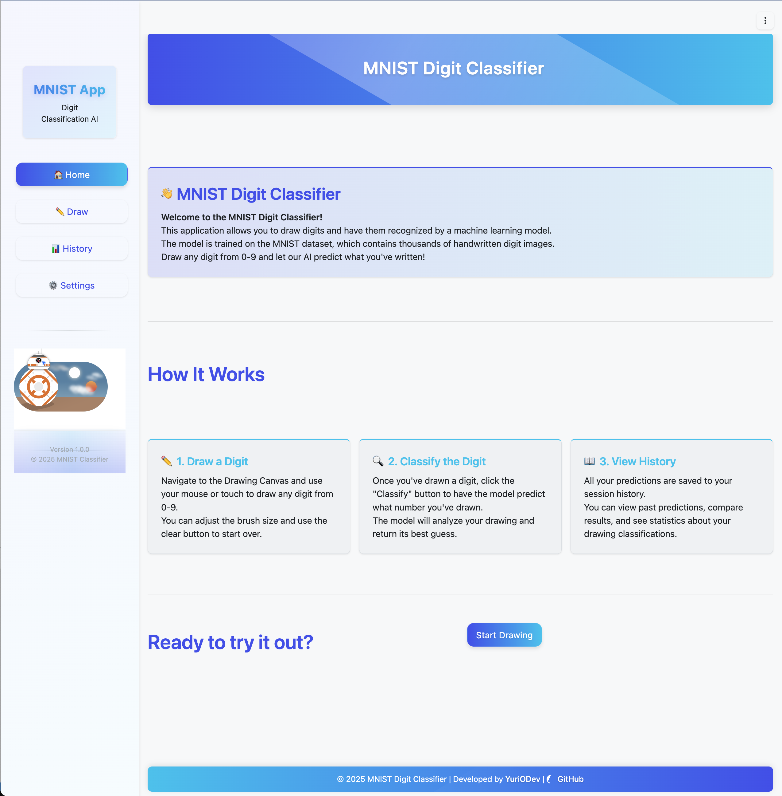
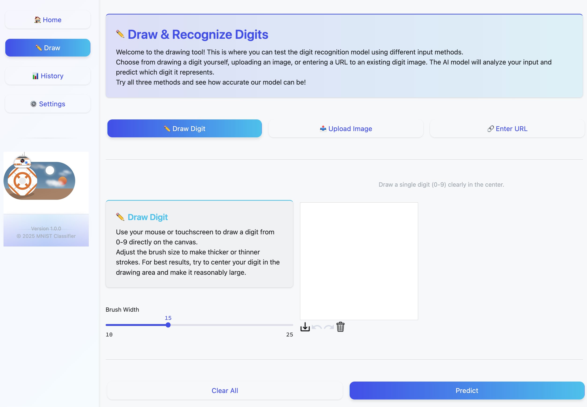
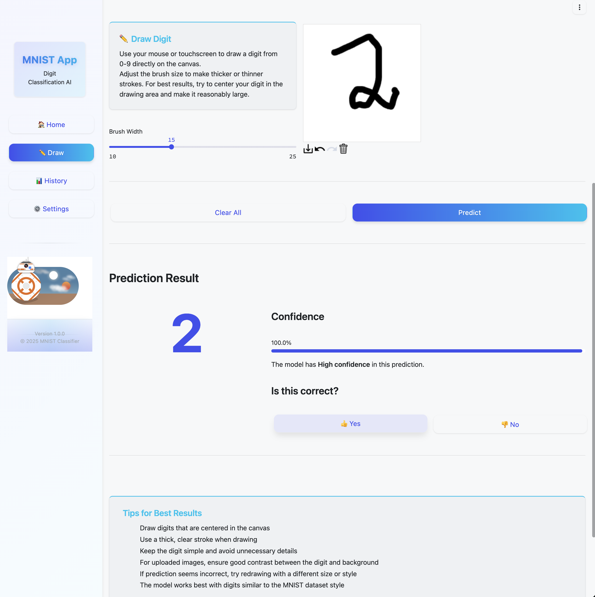
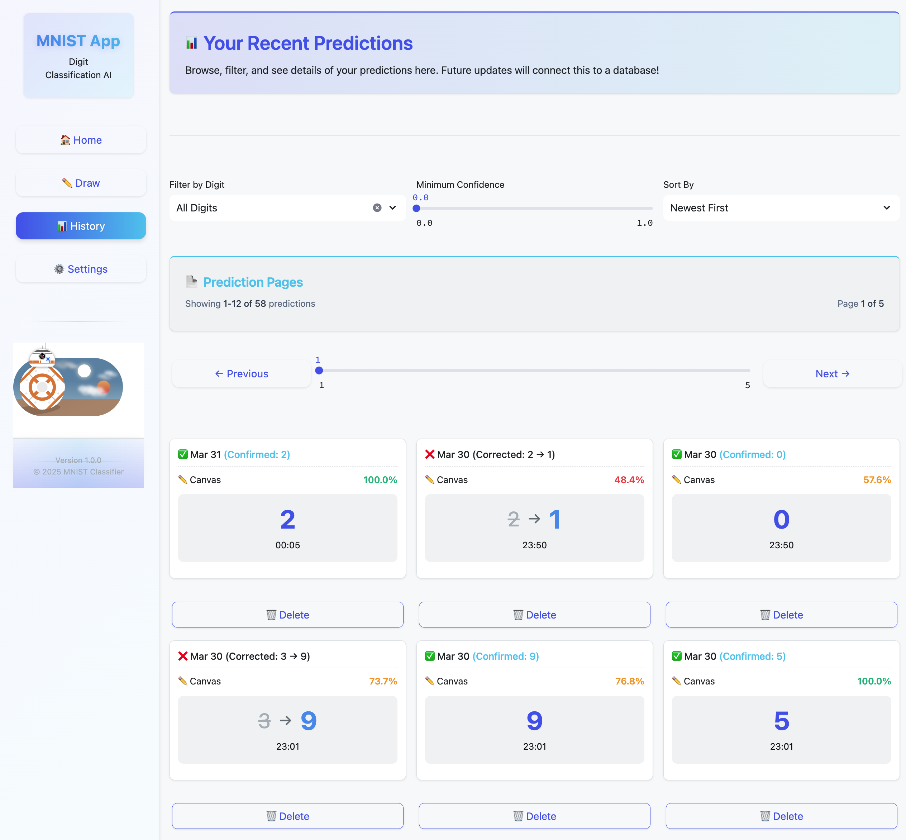

# Web Application (Streamlit Frontend)

This directory contains the source code for the user-facing web application of the MNIST Digit Classifier project. It is built using Streamlit and provides an interactive interface for users to draw digits, upload images, view predictions, and manage their prediction history.



## 🌐 Overview

The web application serves as the primary interface for users to interact with the MNIST digit classification model. It handles user input (drawing, file uploads, URLs), communicates with the backend model service for predictions, interacts with the database to log history, and presents results and settings to the user in an intuitive way.

## ✨ Features

*   **Interactive Drawing Canvas:** Allows users to draw digits directly in the browser using mouse or touch input.

    
    *Placeholder: GIF showing a user drawing a digit on the canvas.*
*   **Image Upload:** Users can upload existing image files (PNG, JPG, JPEG) containing handwritten digits.
*   **URL Input:** Allows users to provide a URL pointing to an image of a digit online.
*   **Real-time Prediction Display:** Shows the model's predicted digit and the associated confidence score.
    
*   **Feedback Mechanism:** Users can indicate whether a prediction was correct and provide the true label if it was wrong.
*   **Prediction History:** Displays a paginated view of past predictions, including timestamps, predicted digits, confidence, and user feedback.!
    
*   **Theme Customization:** Includes settings to switch between light and dark themes.
*   **Responsive Design:** Adapts layout for different screen sizes (desktop, tablet, mobile).

## 💻 Technology Stack

*   **Framework:** [Streamlit](https://streamlit.io/) (for building the interactive web UI)
*   **Drawing:** [streamlit-drawable-canvas](https://github.com/andfanilo/streamlit-drawable-canvas)
*   **HTTP Requests:** [Requests](https://requests.readthedocs.io/en/latest/) (for communicating with the model API)
*   **Image Processing:** [Pillow](https://python-pillow.org/) (for handling image data)
*   **Database Interaction:** [psycopg2-binary](https://www.psycopg.org/docs/) (for connecting to PostgreSQL)
*   **Data Handling:** [Pandas](https://pandas.pydata.org/) (potentially used in history view)
*   **Styling:** Custom CSS & HTML Templates

## 📁 Folder Structure

The `web/` directory is organized as follows:

```plaintext
web/
├── Dockerfile              # Docker build instructions for the web service
├── requirements.txt        # Python dependencies for the web app
├── app.py                  # Main Streamlit application entry point
├── core/                   # Core logic, state management, database interactions
│   ├── app_state/          # Session state management (theme, navigation, etc.)
│   ├── database/           # Database connection and query management (db_manager)
│   └── errors/             # Custom error handling classes
├── ui/                     # User interface components, layouts, and views
│   ├── components/         # Reusable UI elements (buttons, cards, inputs)
│   ├── layout/             # Overall page structure (header, footer, sidebar)
│   ├── theme/              # Theme management (CSS, JS, config)
│   └── views/              # Page-level components (Home, Draw, History, Settings)
├── assets/                 # Static files (CSS, JS, images, templates, config JSONs)
│   ├── css/
│   ├── js/
│   ├── config/
│   ├── images/
│   └── templates/
├── model/                  # Client-side code to interact with the model service
│   └── digit_classifier.py # Class handling model API communication
└── utils/                  # Shared utility functions (resource loading, aspects)
```

## ⚙️ Setup & Running

This web application is designed to run as a service within the project's Docker Compose setup.

*   **Prerequisites:** Ensure you have Docker and Docker Compose installed, as outlined in the main project README.md.
*   **Build & Run:** Navigate to the project's root directory (mnist-digit-classifier/) and run:

```plaintext
docker-compose up --build -d web
```

*   **Access:** Once the container is running, access the application in your web browser, typically at http://localhost:8501.
*   **Dependencies:** The web service depends on the model service (for predictions) and the db service (for history). Docker Compose manages the network connections between these services.
*   **Configuration:** Environment variables (like MODEL_URL, DB_HOST, etc.) are passed from the docker-compose.yml file to the running container.

## 🧩 Key Components

*   **app.py:** The main entry point that orchestrates the Streamlit application, manages routing between views, and initializes core components.
*   **core/:** Contains the application's brain.
    *   **app_state/:** Manages the session state using Streamlit's st.session_state for things like the current theme, active view, canvas data, and prediction history cache.
    *   **database/:** Handles all communication with the PostgreSQL database via the db_manager singleton.
*   **ui/:** Defines the user interface.
    *   **views/:** Each Python file represents a distinct page or view (e.g., HomeView, DrawView).
    *   **components/:** Contains reusable UI elements like buttons, cards, and the drawing canvas, built using Streamlit widgets and custom HTML/CSS/JS.
    *   **layout/:** Defines the overall page structure, including the header, footer, and sidebar.
    *   **theme/:** Manages light/dark themes, CSS loading, and variable injection.
*   **assets/:** Stores all static files required by the frontend, including CSS stylesheets, JavaScript files, configuration JSONs, HTML templates, and images.
*   **model/digit_classifier.py:** A client class responsible for sending image data to the separate model service API and receiving predictions.
